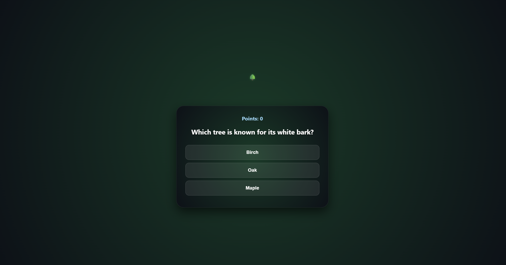
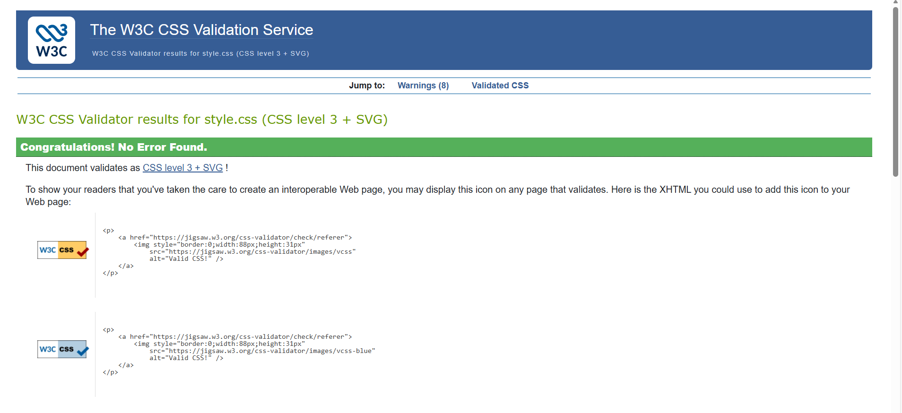

# Hackathon-Project

# Environmentalists

## Description

A single-page interactive and responsive application

This is a quiz game with tree themed questions

Answer the questions correctly to grow your tree, and help to protect the environment

## Features

1. A quiz with multiple questions
2. Clickable buttons
3. Score count
4. Animated rain
5. A tree that grows

## How to View the Project

[View the webpage here] (https://jamalek12.github.io/Hackathon-Project/)

## Contributors

- JamalEK12
- sdri
- Saikou813
- CraigusCodeus

## Credits

For project idea inspiration we used multiple sources, including:

1. Co-Pilot
2. Group individual ideas
3. A previous project for inspiration https://github.com/arun-dhanjal/hackathon-quiz-app; https://arun-dhanjal.github.io/hackathon-quiz-app/

For coding

1. Google web searches were the main source of coding assistance
2. Co-Pilot and Google AI had minimal use for coding assistance
3. Rain animation - written with javascript

Image sources:

Tree images from www.freepik.com

Sound effects sources:

https://www.soundjay.com/

## Validation

